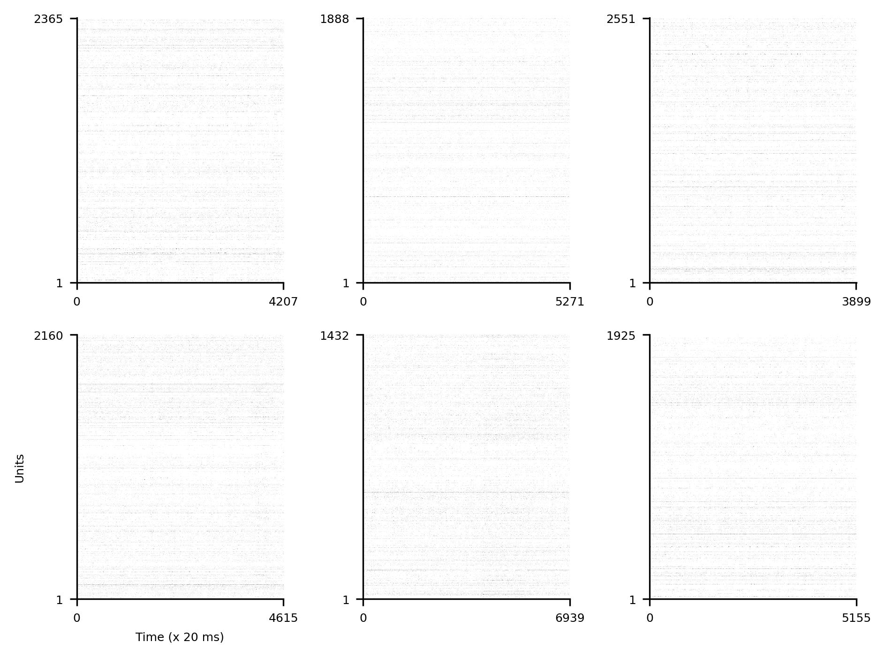

## rodent ephys data

~441B raw tokens of ephys data recorded from rodents (raw=uncompressed, tokens=units x time bins). Unless otherwise noted, the data consist of spike counts within 20 ms time bins recorded from each unit.

The current component datasets and token counts per dataset are as follows:

1. **VBN:** 153,877,057,200 tokens ([dandi:000713](https://dandiarchive.org/dandiset/000713)); sessions = 153
2. **IBL:** 69,147,814,139 tokens ([dandi:000409](https://dandiarchive.org/dandiset/000409)); sessions = 347
3. **SHIELD:** 61,890,305,241 tokens ([dandi:001051](https://dandiarchive.org/dandiset/001051)); sessions = 99
4. **VCN:** 36,681,686,005 tokens ([dandi:000021](https://dandiarchive.org/dandiset/000021)); sessions = 32
5. **VCN-2:** 30,600,253,445 tokens ([dandi:000022](https://dandiarchive.org/dandiset/000022)); sessions = 26
6. **V2H:** 24,600,171,007 tokens ([dandi:000690](https://dandiarchive.org/dandiset/000690)); sessions = 25
7. **Petersen:** 15,510,368,376 tokens ([dandi:000059](https://dandiarchive.org/dandiset/000059)); sessions = 24
8. **Oddball:** 14,653,641,118 tokens ([dandi:000253](https://dandiarchive.org/dandiset/000253)); sessions = 14
9. **Illusion:** 13,246,412,456 tokens ([dandi:000248](https://dandiarchive.org/dandiset/000248)); sessions = 12
10. **Huszar:** 8,812,474,629 tokens ([dandi:000552](https://dandiarchive.org/dandiset/000552)); sessions = 65
11. **Steinmetz:** 7,881,422,592 tokens ([dandi:000017](https://dandiarchive.org/dandiset/000017)); sessions = 39
12. **Finkelstein:** 1,313,786,316 tokens ([dandi:000060](https://dandiarchive.org/dandiset/000060)); sessions = 98
13. **Giocomo:** 1,083,328,404 tokens ([dandi:000053](https://dandiarchive.org/dandiset/000053)); sessions = 349
14. **Steinmetz-2:** 684,731,334 tokens ([figshare:7739750](https://figshare.com/articles/dataset/Eight-probe_Neuropixels_recordings_during_spontaneous_behaviors/7739750)); sessions = 3
15. **Mehrotra:** 465,402,824 tokens ([dandi:000987](https://dandiarchive.org/dandiset/000987)); sessions = 14
16. **Iurilli:** 388,791,426 tokens ([dandi:000931](https://dandiarchive.org/dandiset/000931)); sessions = 1
17. **Gonzalez:** 366,962,209 tokens ([dandi:000405](https://dandiarchive.org/dandiset/000405)); sessions = 276
18. **Li:** 260,807,325 tokens ([dandi:000010](https://dandiarchive.org/dandiset/000010)); sessions = 99

Total number of tokens: 441,465,416,046. 

The combined dataset can be accessed from [this](https://huggingface.co/datasets/eminorhan/neural-bench-rodent) public HF repository. The combined dataset takes up about 47 GB when stored as `.parquet` files and roughly 443 GB when stored as `.arrow` files (see [this](https://stackoverflow.com/a/56481636) for an explanation of the differences between these file formats).

### Visualizing the datasets
`visualize_datasets.py` provides some basic functionality to visualize random samples from the datasets:
```python
python visualize_datasets.py --repo_name 'eminorhan/vbn' --n_examples 6
```
This will randomly sample `n_examples` examples from the corresponding dataset and visualize them as below, where *x* is the time axis (binned into 20 ms windows) and the *y* axis represents the recorded units:



### Note:
Running `merge_datasets.py` successfully requires a patch in the `huggingface_hub` library. The HF `datasets` library doesn't do retries while loading datasets from the hub (`load_dataset`) or when pushing them to the hub (`push_to_hub`). This almost always results in connection errors for large datasets in my experience, aborting the loading or pushing of the dataset. The patch involves adding a "retry" functionality to `huggingface_hub`'s default session backend factory. Specifically, you need to update the `_default_backend_factory()` function in `huggingface_hub/utils/_http.py` with:
```python
from requests.adapters import HTTPAdapter, Retry

...

def _default_backend_factory() -> requests.Session:
    session = requests.Session()
    retries = Retry(total=20, backoff_factor=0.1, status_forcelist=[500, 502, 503, 504])
    if constants.HF_HUB_OFFLINE:
        session.mount("http://", OfflineAdapter(max_retries=retries))
        session.mount("https://", OfflineAdapter(max_retries=retries))
    else:
        session.mount("http://", UniqueRequestIdAdapter(max_retries=retries))
        session.mount("https://", UniqueRequestIdAdapter(max_retries=retries))
    return session
```  
or something along these lines (you can play with the `Retry` settings). This will prevent the premature termination of the job when faced with connection issues. 